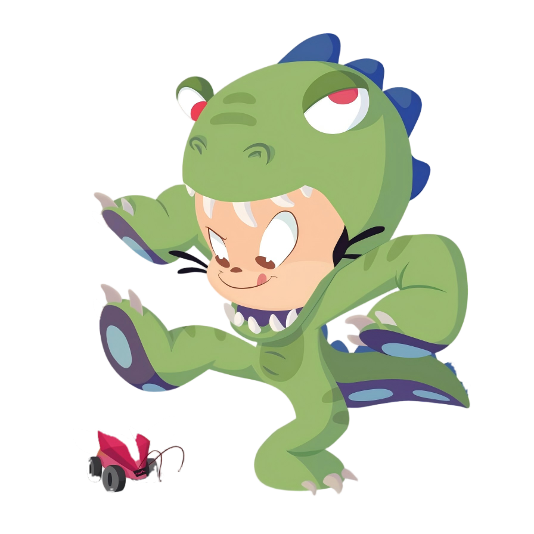

  

# Yanpei Gong

**Undergraduate @ HIT** &nbsp;|&nbsp; **Research Assistant @ Tsinghua SIGS**

I build efficient and practical AI systems — **AI agents**, **multimodal understanding**, **research-oriented applications**.

> *"Growth is a collective act. In the echo of others, we find our own voice."*

## About

- Currently an undergraduate student at **HIT**
- Completed research internships across **THU** and **CASIA**
- Current work at **Tsinghua SIGS** focuses on **AI agents**

## Research Interests

- AI Agents
- Open-domain Video Understanding and Retrieval
- Fine-grained Visual Understanding

## Skills

  
  
  
  
  
  
  
  
  

## Contact

If you are interested in collaboration, feel free to reach out.

- GitHub: [@yanpeigong](https://github.com/yanpeigong)
- Email: 2023211640@stu.hit.edu.cn

---

<i>Open to research collaboration and meaningful open-source contributions.</i>

